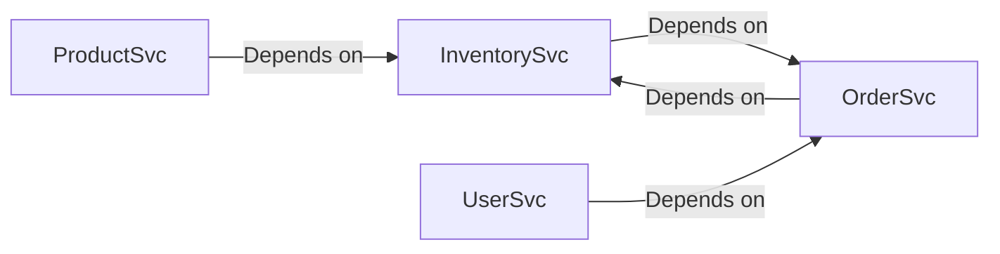

# Stock Platform - Service Architecture

This document outlines the service architecture and gRPC client integration for the Stock Platform.

## Service Overview

The Stock Platform is composed of the following microservices:

1. **Product Service** (`productSvc`)
   - Manages product catalog and details
   - gRPC port: 50052
   - Depends on: Inventory Service

2. **Inventory Service** (`inventorySvc`)
   - Manages product inventory and stock levels
   - gRPC port: 50053
   - Depends on: Order Service

3. **Order Service** (`orderSvc`)
   - Handles order processing and management
   - gRPC port: 50054
   - Depends on: Inventory Service

4. **User Service** (`userSvc`)
   - Manages user accounts and authentication
   - gRPC port: 50055
   - Depends on: Order Service

## gRPC Client Integration

### Client Package

The `pkg/grpcclient` package provides reusable gRPC clients for all services:

```go
// Example: Creating and using the Product client
productClient, err := grpcclient.NewProductClient("product-service:50052")
if err != nil {
    log.Fatalf("Failed to create product client: %v", err)
}
defer productClient.Close()

// Get a product
product, err := productClient.GetProduct(ctx, &productv1.GetProductRequest{Id: "123"})
```

### Service Integration

Each service includes an integration service that coordinates with other services:

1. **Product Service**
   - `ProductInventoryService`: Coordinates between product and inventory services
   - Handles product creation with inventory initialization

2. **Inventory Service**
   - `InventoryOrderService`: Manages inventory updates based on order events
   - Handles stock reservation and fulfillment

3. **Order Service**
   - `OrderInventoryService`: Coordinates order processing with inventory
   - Ensures inventory is available before order confirmation

4. **User Service**
   - `UserAuthService`: Manages user authentication and profile operations
   - Integrates with order service for user order history

## Environment Variables

### Common Variables
- `GRPC_PORT`: Port for gRPC server (default varies by service)
- `MONGO_URI`: MongoDB connection string (default: `mongodb://localhost:27017`)

### Service-Specific Variables

#### Product Service
- `INVENTORY_SERVICE_ADDR`: Address of inventory service (default: `inventory-service:50053`)

#### Inventory Service
- `ORDER_SERVICE_ADDR`: Address of order service (default: `order-service:50054`)

#### Order Service
- `INVENTORY_SERVICE_ADDR`: Address of inventory service (default: `inventory-service:50053`)

#### User Service
- `ORDER_SERVICE_ADDR`: Address of order service (default: `order-service:50054`)
- `JWT_SECRET`: Secret key for JWT token generation

## Running the Services

1. Start MongoDB:
   ```bash
   docker run -d -p 27017:27017 --name mongodb mongo:latest
   ```

2. Start each service in its own terminal:
   ```bash
   # Terminal 1 - Product Service
   cd services/productSvc
   go run cmd/main.go

   # Terminal 2 - Inventory Service
   cd services/inventorySvc
   go run cmd/main.go

   # Terminal 3 - Order Service
   cd services/orderSvc
   go run cmd/main.go

   # Terminal 4 - User Service
   cd services/userSvc
   go run cmd/main.go
   ```

## Service Dependencies



## Error Handling

All gRPC clients include proper error handling and connection management. Services will fail to start if required dependencies are not available.

## Monitoring and Logging

Each service uses structured logging with `zap`. Logs include request IDs for tracing requests across services.
